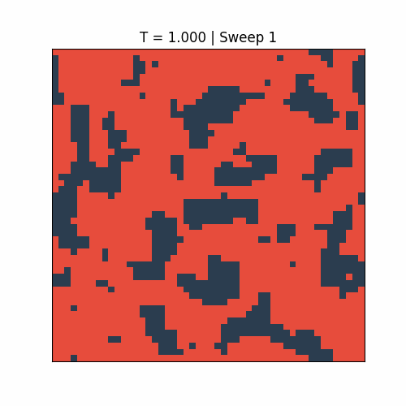
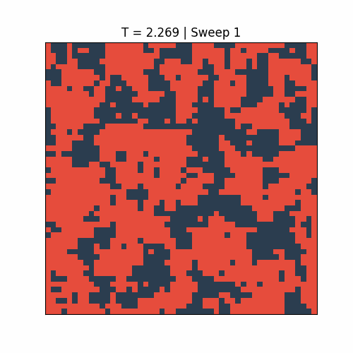
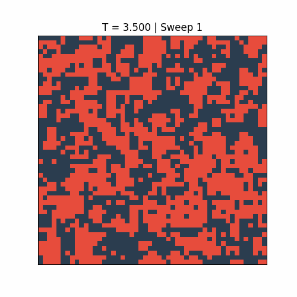

# 2D Ising Model: MCMC Simulation & Critical Phenomena

A computational physics project simulating the 2D Ising model using the **Metropolis–Hastings algorithm** to study the ferromagnetic phase transition. Reproduces the critical temperature **T_c ≈ 2.269** (in units of J/k_B) and extracts critical exponents β and δ from simulated data.

| Ordered (T = 1.0) | Critical (T ≈ 2.269) | Disordered (T = 3.5) |
|---|---|---|
|  |  |  |

---

## Repository Structure

```
.
├── 01_simulate_ising.ipynb      # Run MCMC simulation, generate data and figures
├── 02_load_and_explore.ipynb    # Load saved data, reproduce analysis plots
├── 03_critical_exponents.ipynb  # Fit critical exponents β and δ
├── ising_data.npz               # Pre-computed simulation output (T-sweep)
├── ising_delta_data.npz         # Pre-computed simulation output (B-sweep at T_c)
├── phase_transition.png         # |M| vs T order parameter plot
├── burnin_convergence.png       # Burn-in diagnostic across temperatures
├── lattice_snapshots.png        # Side-by-side lattice snapshots at T = 1.0, T_c, 3.5
├── equil_T1.gif                 # Equilibration animation at T = 1.0
├── equil_critical.gif           # Equilibration animation at T ≈ 2.269
└── equil_T3_5.gif               # Equilibration animation at T = 3.5
```

---

## Quickstart (UC Berkeley Datahub)

1. Open [Datahub](https://datahub.berkeley.edu) and start a Python 3 server.
2. Clone this repository:
   ```bash
   git clone https://github.com/edenmhuang/Physic-77-88-Simulating-2D-Ising-Model.git
   cd Physic-77-88-Simulating-2D-Ising-Model
   ```
3. To reproduce everything from scratch, run the notebooks **in order**:
   - `01_simulate_ising.ipynb` — runs the MCMC sweep, saves `ising_data.npz`, and produces all figures and GIFs (~5–10 min)
   - `02_load_and_explore.ipynb` — loads `ising_data.npz` and reproduces analysis plots inline
   - `03_critical_exponents.ipynb` — loads both `.npz` files and fits critical exponents β and δ

> **Tip:** You can skip step 3 entirely. Both `ising_data.npz` and `ising_delta_data.npz` are pre-computed and included in the repo. Jump straight to notebooks 02 and 03.

---

## Simulation Parameters

Set at the top of `01_simulate_ising.ipynb`:

```python
N        = 50    # Lattice size (N × N)
BURNIN   = 250   # Burn-in sweeps discarded before measurement
N_MEAS   = 500   # Measurement sweeps per temperature
N_TRIALS = 3     # Independent trials averaged per temperature
B        = 0.0   # External magnetic field (zero-field)
T_CRIT   = 2.0 / np.log(1.0 + np.sqrt(2.0))  # Exact T_c ≈ 2.2692
```

The temperature grid uses 40 points spaced more densely near T_c:

```python
T_low      = np.linspace(0.5, 2.0, 10, endpoint=False)
T_critical = np.linspace(2.0, 2.5, 20, endpoint=False)   # 2× density near T_c
T_high     = np.linspace(2.5, 4.0, 10)
T_range    = np.concatenate([T_low, T_critical, T_high])  # 40 points total
```

---

## Notebook Descriptions

### `01_simulate_ising.ipynb` — Simulation

Implements and runs the full MCMC simulation.

**Key functions:**

- `delta_energy(lattice, i, j)` — computes the energy change ΔE for a proposed spin flip using periodic boundary conditions
- `metropolis_sweep(lattice, T)` — performs one sweep (N² random single-spin flip proposals) using the Metropolis acceptance rule
- `total_energy(lattice)` — computes total energy per spin via nearest-neighbor sum
- `total_magnetization(lattice)` — computes mean magnetization per spin
- `run_simulation(T, n_burnin, n_meas, N)` — runs burn-in then records energy and |M| over measurement sweeps

**Outputs produced:**

| Output | Description |
|---|---|
| `burnin_convergence.png` | |M| vs sweeps at 7 temperatures (T = 0.5, 1.0, 2.0, T_c, 2.5, 3.5, 5.0), 5 trials each, with burn-in=250 marked |
| `lattice_snapshots.png` | Side-by-side spin lattice at T = 1.0 (ordered), T_c (critical), T = 3.5 (disordered) |
| `phase_transition.png` | |M| vs T with error bars and T_c reference line |
| `equil_T1.gif` | 300-frame equilibration animation at T = 1.0 |
| `equil_critical.gif` | 300-frame equilibration animation at T = T_c |
| `equil_T3_5.gif` | 300-frame equilibration animation at T = 3.5 |
| `ising_data.npz` | All computed arrays (see Data section below) |

### `02_load_and_explore.ipynb` — Exploration

Loads `ising_data.npz` and reproduces analysis plots (heat capacity C_v, susceptibility χ, and |M|) inline. No simulation re-run required.

### `03_critical_exponents.ipynb` — Critical Exponents

Fits two critical exponents from the saved data.

**Exponent β (order parameter):** Filters data to T ∈ (1.96, T_c), transforms to log–log coordinates using τ = (T_c − T)/T_c, fits a linear model to extract β. Theoretical value: β = 0.125.

**Exponent δ (field dependence):** Runs a separate B-sweep at T = T_c over B ∈ [−0.5, 0.5] (41 points, 3 trials each, same burn-in and measurement sweeps as notebook 01). Fits log|m| vs log|B| separately for B < 0 and B > 0 to extract δ = 1/slope. Theoretical value: δ = 15. Saves results to `ising_delta_data.npz`.

---

## Reproducing Figures

| Figure | Notebook | Output |
|---|---|---|
| Phase transition \|M\| vs T | `01_simulate_ising.ipynb` | `phase_transition.png` |
| Burn-in convergence | `01_simulate_ising.ipynb` | `burnin_convergence.png` |
| Lattice snapshots | `01_simulate_ising.ipynb` | `lattice_snapshots.png` |
| Equilibration GIFs | `01_simulate_ising.ipynb` | `equil_T1.gif`, `equil_critical.gif`, `equil_T3_5.gif` |
| C_v and χ analysis plots | `02_load_and_explore.ipynb` | inline |
| Critical exponent β fit | `03_critical_exponents.ipynb` | inline |
| Critical exponent δ fit | `03_critical_exponents.ipynb` | inline |

---

## Data

### `ising_data.npz`

Generated by `01_simulate_ising.ipynb`. Contains arrays of length 40 over the T-sweep:

| Key | Description |
|---|---|
| `T_range` | Temperature grid (40 points, denser near T_c) |
| `mean_M_arr` | Mean absolute magnetization \|M\| averaged over N_TRIALS |
| `std_M_arr` | Std of \|M\| across trials |
| `mean_E_arr` | Mean energy per spin |
| `std_E_arr` | Std of energy across trials |
| `mean_Cv` | Heat capacity C_v = (1/T²) · Var(E) · N² |
| `mean_chi` | Magnetic susceptibility χ = (1/T) · Var(M) · N² |

### `ising_delta_data.npz`

Generated by `03_critical_exponents.ipynb`. Contains arrays of length 41 over the B-sweep at T = T_c:

| Key | Description |
|---|---|
| `B_range` | External field values, linspace(−0.5, 0.5, 41) |
| `mean_M_B` | Mean magnetization ⟨m⟩ at each B |
| `std_error_M_B` | Standard error of ⟨m⟩ across trials |

---

## Environment

- **Python:** 3.9.6
- **Packages:** `numpy`, `matplotlib`, `scipy`

Runs out-of-the-box on UC Berkeley Datahub with no additional setup.
